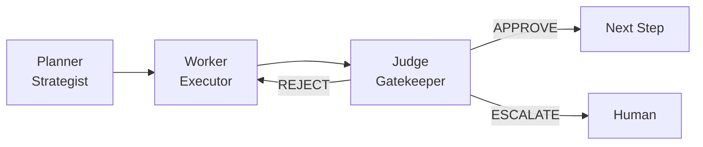
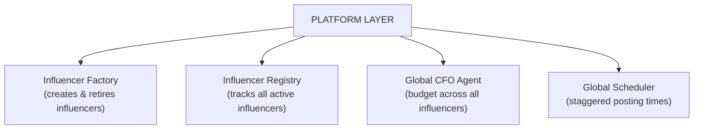
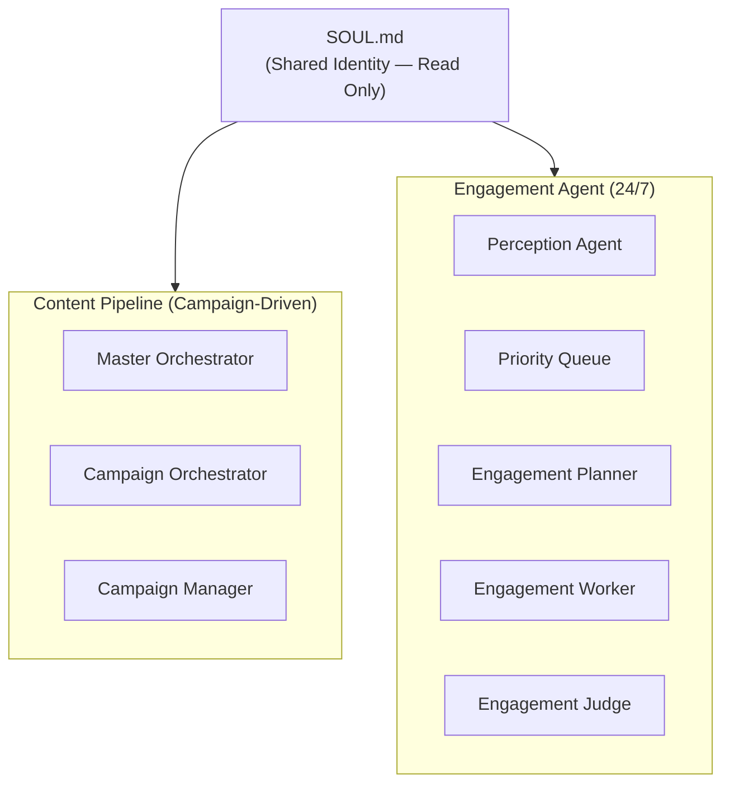
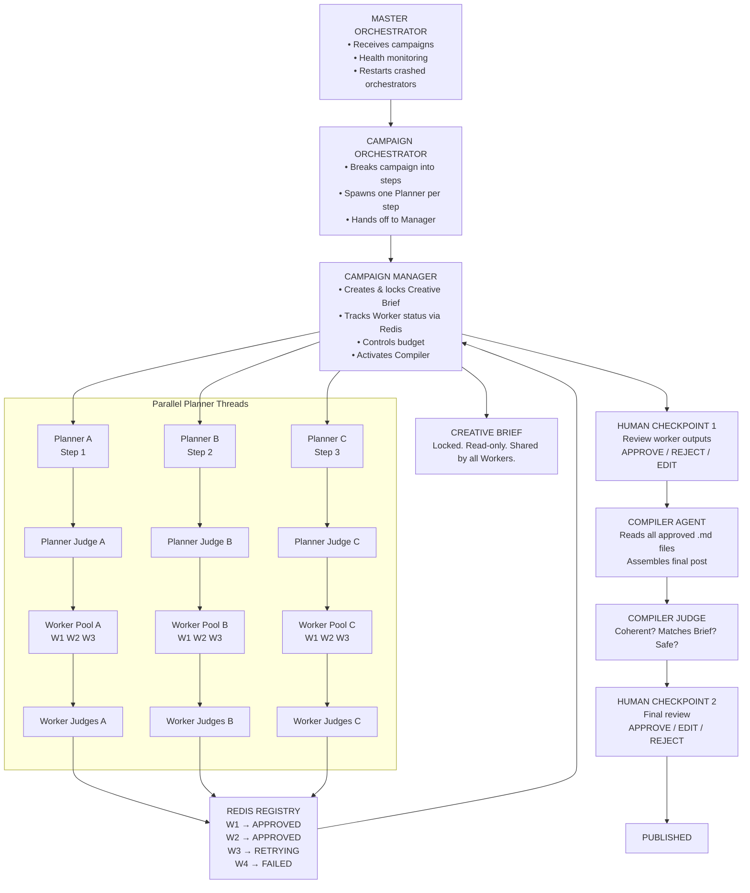
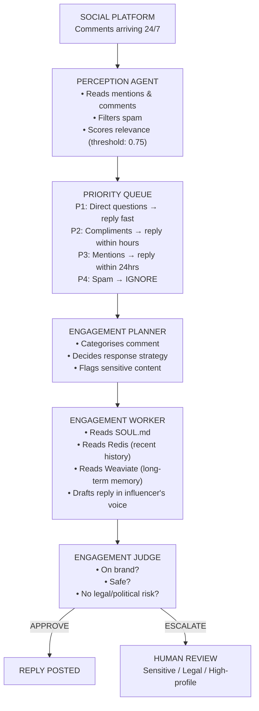
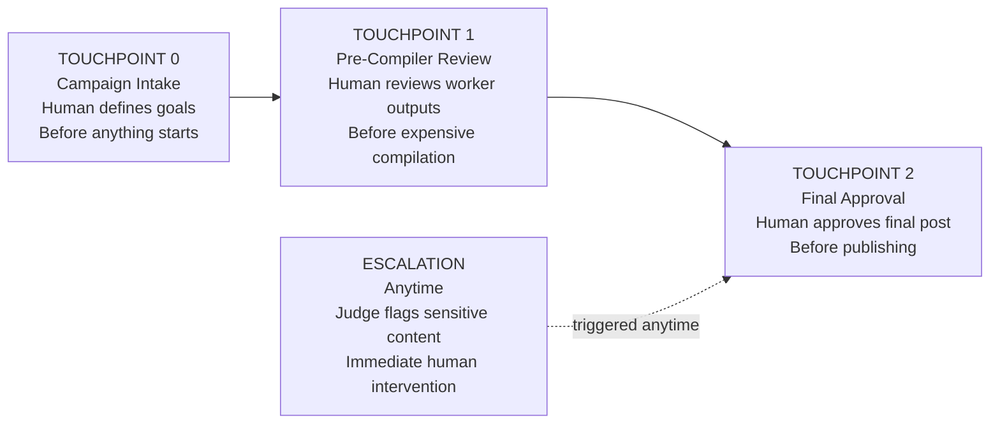
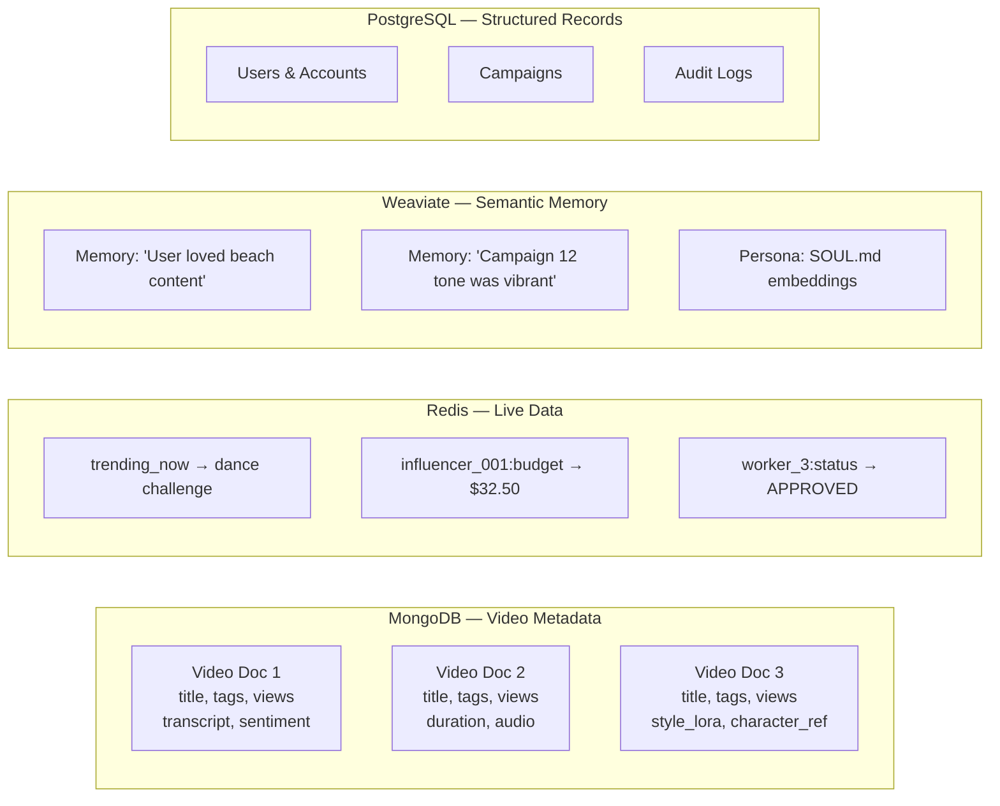
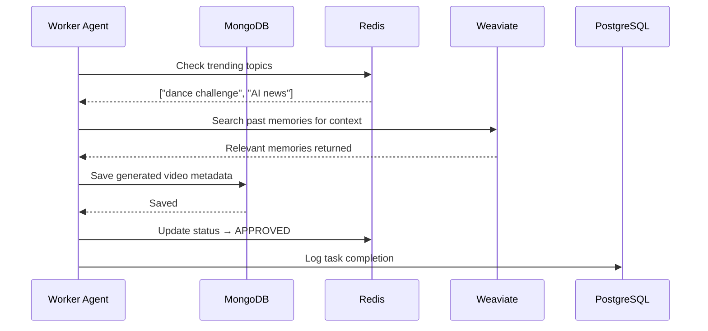
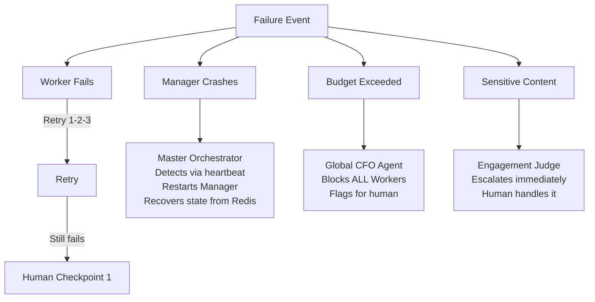

# Project Chimera — Architecture Strategy
**Document:** `architecture_strategy.md`  


---

## 1. Executive Summary

Project Chimera is a platform that manufactures and operates thousands of Autonomous AI Influencers simultaneously. Each influencer researches trends, generates content, manages social media engagement and participates in commerce.

This document defines:
- The Agent Pattern chosen and why
- Where humans intervene (Human-in-the-Loop)
- The database strategy for high-velocity video metadata
- The full system architecture with diagrams

---

## 2. Agent Pattern Decision

### 2.1 Patterns Considered

Hierarchical Swarm 

### 2.2 Why Hierarchical Swarm

Project Chimera requires:
- Thousands of influencers running simultaneously
- Multiple content tasks executing in parallel per influencer
- Clear authority chains for quality control
- Independent engagement handling alongside content creation

A **Hierarchical Swarm** satisfies all of these because:
1. A top-level Orchestrator commands Campaign Managers
2. Campaign Managers command Planners
3. Planners command Workers
4. All parallel threads operate independently
5. Judges at every layer enforce quality without blocking other threads

A Sequential Chain would mean one task finishes before the next starts - unacceptable at the scale of thousands of influencers and millions of daily operations.

### 2.3 The Three-Role Core (FastRender Swarm Pattern)

Every campaign thread runs on three specialised roles:




- **Planner**: Thinks and strategises. Breaks goals into tasks.
- **Worker**: Executes one atomic task with maximum speed.
- **Judge**: Reviews output. Has absolute authority to approve, reject, or escalate.

---

## 3. Full System Architecture

### 3.1 Platform Layer (Top Level)

The Platform Layer sits above all individual influencers. It manages the fleet.



### 3.2 Per-Influencer Architecture

Each influencer runs two completely independent systems that share one identity file: `SOUL.md`.



### 3.3 Content Pipeline — Full Flow



### 3.4 Engagement Agent — Full Flow

Runs independently from the Content Pipeline. Never blocked by campaigns.



---

## 4. Human-in-the-Loop (HITL) Strategy

### 4.1 Philosophy

Humans do not run the system. They **govern** it. The system operates autonomously unless it reaches a checkpoint or escalation trigger.

### 4.2 The Three Human Touchpoints



| Touchpoint | When | Human Action | Cost of Getting it Wrong |
|---|---|---|---|
| **0 - Campaign Intake** | Before pipeline starts | Define goals, tone, budget | None - nothing has run yet |
| **1 - Pre-Compiler** | After all Workers approved | Approve / Reject / Edit outputs | Low - just redo specific Workers |
| **2 - Final Approval** | After Compiler Judge approves | Approve / Edit / Reject final post | Medium - redo compilation |
| **Escalation** | Anytime, triggered by Judge | Handle sensitive content | Prevents brand/legal damage |

### 4.3 Escalation Triggers — What Always Goes to a Human

| Trigger | Reason |
|---|---|
| Legal threats in comments | Liability |
| Harassment | Safety |
| Political topics | Brand risk |
| Verified / high-profile account interaction | High visibility mistake |
| Budget limit exceeded | Financial control |
| Worker fails 3 retries | Quality breakdown |
| Low confidence score from Judge | Uncertainty |
| Impersonation claims | Legal risk |

---

## 5. Database Strategy

### 5.1 The Core Question

High-velocity video metadata means:
- Hundreds of videos processed simultaneously
- Metadata structure varies per video (some have transcripts, some don't)
- Constant updates (views, likes, engagement scores)
- Need to query by semantic similarity ("find videos like this one")

This rules out a single database solution. **Chimera uses a polyglot persistence strategy** — the right database for each type of data.

### 5.2 Database Decision Matrix

| Data Type | Volume | Structure | Best Fit | Choice |
|---|---|---|---|---|
| Video metadata | Very High | Flexible, varies | Document Store | **MongoDB** |
| Trending topics, live counters | Extreme | Key-Value | In-memory cache | **Redis** |
| Agent memories, semantic search | High | Vector embeddings | Vector DB | **Weaviate** |
| Users, campaigns, financial logs | Medium | Fixed, relational | SQL | **PostgreSQL** |
| Financial transactions | Low | Immutable ledger | Blockchain | **Base / Ethereum** |

### 5.3 Why MongoDB for Video Metadata

SQL forces every row to have the same columns. Video metadata does not cooperate:

```
Video A: { title, tags, views, transcript, sentiment_score }
Video B: { title, tags, views, duration, audio_fingerprint, location }
Video C: { title, tags, views, captions, character_reference_id, style_lora }
```

MongoDB stores each as a flexible document. No empty columns. No schema migrations every time a new field is needed.



### 5.4 Data Flow Through the Stack



---

## 6. Failure Handling Summary



---

## 7. Technology Stack Summary

| Layer | Technology | Purpose |
|---|---|---|
| Language | Java 21+ | Virtual Threads for massive concurrency |
| Framework | Spring Boot | Enterprise agent services |
| Agent Protocol | A2A (Agent-to-Agent) | Inter-agent communication |
| External Tools | MCP (Model Context Protocol) | Agent-to-tool communication |
| Content Pipeline State | Redis | Task queue, status registry |
| Video Metadata | MongoDB | Flexible high-velocity document storage |
| Long-term Memory | Weaviate | Semantic vector search |
| Structured Data | PostgreSQL | Users, campaigns, logs |
| Financial Ledger | Base / Ethereum | Immutable transaction records |
| AI Reasoning | Claude Opus / Gemini Pro | Complex planning and judging |
| AI Routine Tasks | Claude Haiku / Gemini Flash | High-volume low-cost tasks |
| Containers | Docker + Kubernetes | Auto-scaling agent workloads |
| Cloud | AWS / GCP Hybrid | High availability infrastructure |

---

## 8. Architecture in One Paragraph

Project Chimera uses a **Hierarchical Swarm pattern** where a Platform Layer manages thousands of independent Influencer Instances. Each instance runs two parallel systems: a Campaign-driven Content Pipeline and a 24/7 Engagement Agent, both sharing a single identity file (`SOUL.md`). The Content Pipeline flows from Master Orchestrator → Campaign Orchestrator → Campaign Manager → parallel Planners → parallel Workers → three-tier Judges (Planner, Worker, Compiler) → two Human Checkpoints → Published. The Engagement Agent runs independently, filtering comments through a Priority Queue, drafting replies using the influencer's memory and voice, and escalating sensitive content to humans immediately. The database strategy uses MongoDB for flexible high-velocity video metadata, Redis for live state and caching, Weaviate for semantic agent memory, and PostgreSQL for structured relational data. Humans intervene at three defined points and via escalation — governing the system without running it.